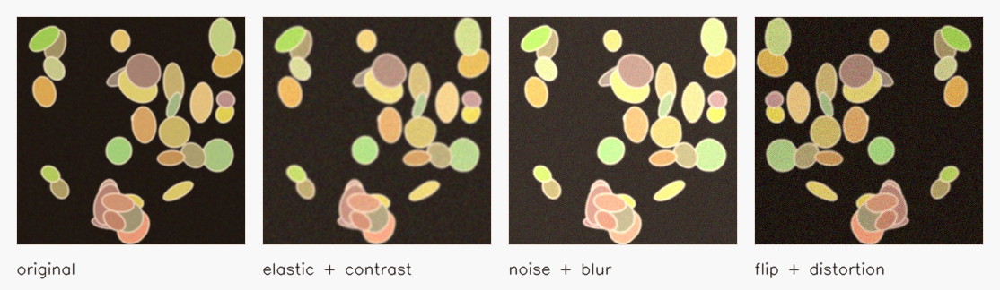

# Image Data Augmentation CLI

[](https://github.com/1v4mp1r3/Image-Data-Augmentation-CLI/actions/workflows/ci.yml)
[](https://github.com/1v4mp1r3/Image-Data-Augmentation-CLI/releases)
[](LICENSE)
[](pyproject.toml)

High-throughput CLI for reproducible image dataset augmentation with
Albumentations, OpenCV, multiprocessing, YAML/JSON configs, YOLO bounding boxes,
and segmentation masks.



## Quick Start

Install:

```bat
install_requirements.bat
```

Run:

```bat
run_imgaug.bat --input C:\path\to\images --output C:\path\to\augmented --config configs\example.yaml
```

Without the Windows helper scripts:

```powershell
pip install -e .
imgaug --input C:\path\to\images --output C:\path\to\augmented --config configs\example.yaml
```

## Features

- Recursive image discovery with preserved folder structure.
- YAML and JSON configs for reproducible augmentation runs.
- Albumentations pipelines with resize, crop, flips, rotations, affine transforms,
  ElasticTransform, GridDistortion, OpticalDistortion, blur, Gaussian noise,
  Salt & Pepper noise, CLAHE, gamma, brightness, and contrast.
- Multiprocessing worker pool with configurable `workers` and `chunksize`.
- Rich progress output for large datasets.
- YOLO bounding box support with synchronized geometric transforms.
- Segmentation mask support with synchronized geometric transforms.
- Windows `.bat` helpers for install and execution.

## Config Example

```yaml
output:
  samples_per_image: 3
  format: jpeg
  suffix: "_aug{index:03d}"
  preserve_tree: true

runtime:
  workers: null
  chunksize: 16

annotations:
  yolo:
    enabled: false
  masks:
    enabled: false

transforms:
  - name: Resize
    params: {height: 512, width: 512, p: 1.0}
  - name: HorizontalFlip
    params: {p: 0.5}
  - name: ElasticTransform
    params: {alpha: 35, sigma: 6, border_mode: 2, p: 0.2}
  - name: RandomBrightnessContrast
    params:
      brightness_limit: [-0.15, 0.15]
      contrast_limit: [-0.12, 0.12]
      p: 0.45
```

See [configs/example.yaml](configs/example.yaml) and
[configs/yolo_masks.yaml](configs/yolo_masks.yaml).

## YOLO and Mask Layout

For YOLO labels:

```text
dataset/
  images/class_a/img001.jpg
  labels/class_a/img001.txt
```

Run with `--input dataset\images --output dataset_aug\images`. Relative
annotation directories such as `labels` and `masks` are resolved as siblings of
the image root.

Use:

```yaml
annotations:
  yolo:
    enabled: true
    labels_dir: labels
    output_labels_dir: labels_aug
    allow_missing: false
    min_visibility: 0.15
    clip: true
```

For segmentation masks:

```text
dataset/
  images/class_a/img001.jpg
  masks/class_a/img001.png
```

Use:

```yaml
annotations:
  masks:
    enabled: true
    masks_dir: masks
    output_masks_dir: masks_aug
    mask_extension: png
    allow_missing: false
```

The key rule: image, bounding boxes, and mask are passed to Albumentations in the
same call, so rotations, flips, elastic warps, and crops stay aligned.

## Architecture

- `image_aug_cli/cli.py` owns the command-line surface and exit codes.
- `image_aug_cli/config.py` parses and validates YAML/JSON config files.
- `image_aug_cli/pipeline.py` converts config transform specs into an
  Albumentations `Compose` pipeline.
- `image_aug_cli/annotations.py` reads and writes YOLO labels and masks.
- `image_aug_cli/io.py` handles recursive discovery plus OpenCV image I/O.
- `image_aug_cli/engine.py` coordinates multiprocessing, workers, and progress.

## I/O Notes

For 10,000+ images, the parent process only discovers paths. Each worker reads
its own image and annotations, augments them, and writes outputs. On SSDs,
`workers = cpu_count` is usually fine. On HDDs or network disks, start with
2-4 workers to avoid overwhelming writes. Keep PNG compression moderate and use
JPEG quality around 90-95 for practical dataset throughput.

## Distribution Ideas

- Write a Habr-style post: "How I built a CLI for image dataset augmentation".
- Share examples in ML Telegram channels.
- Post a compact demo to `r/Python`, `r/computervision`, or `r/MachineLearning`.
- Add real-world before/after grids from medical, industrial, or object detection
  datasets as the tool grows.
